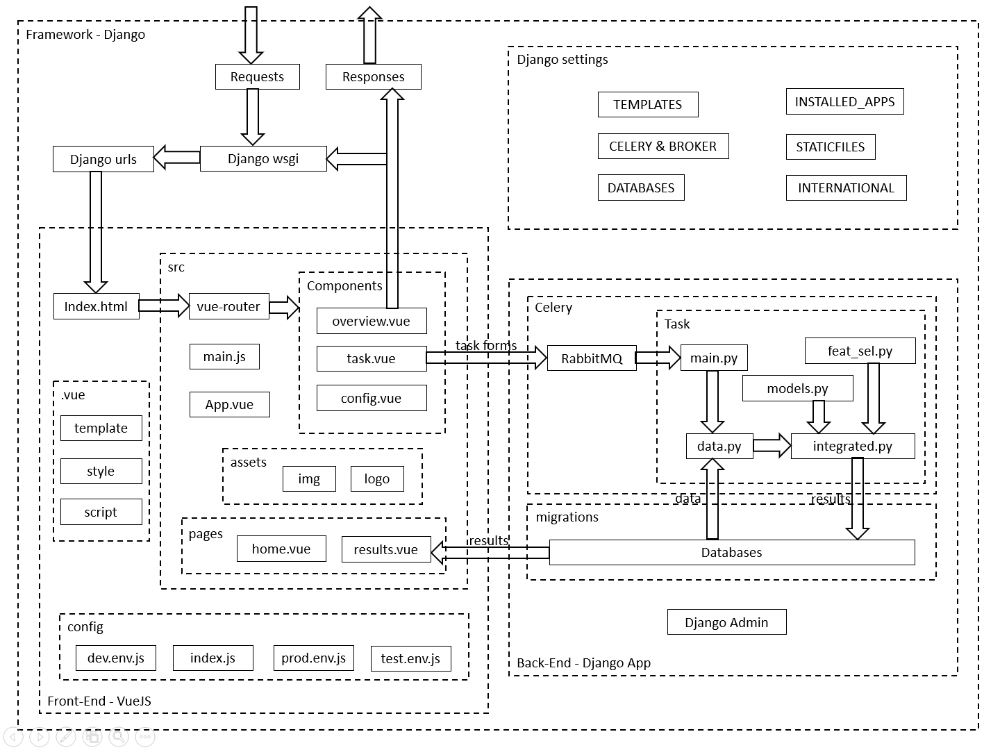

---

## Contents
- [Contents](#contents)
- [Django+VueJS+Celery](#djangovuejscelery)
  - [Environment](#environment)
  - [Build Project](#build-project)
  - [Architecture Design](#architecture-design)
  - [Integrate Vue into Django](#integrate-vue-into-django)
  - [Integrate Celery into Django](#integrate-celery-into-django)
- [NEURO-LEARN-WEB](#neuro-learn-web)
  - [UI Design](#ui-design)
  - [User Interface](#user-interface)
    - [Vue and Element-UI](#vue-and-element-ui)
    - [Data Transaction](#data-transaction)
    - [File Uploading](#file-uploading)
    - [Visualization](#visualization)
  - [Service](#service)
    - [Celery and RabbitMQ](#celery-and-rabbitmq)
    - [Databases](#databases)
  - [Deployment](#deployment)
    - [GitHub](#github)

## Django+VueJS+Celery

### Environment

- For Django: Python, Django, MySQL, etc. Using pip to install modules including Django and MySQL is recommended;
- For Vue: Node.js. Using npm to install modules including Element-UI is recommended;
- For celery: rabbitmq, celery, django-celery. Using apt-get to install rabbitmq-server, and pip to install celery and django-celery;

### Build Project

- Create project;  
```
$ django-admin startproject neurolearn
```
- Create Django app as backend;  
```
$ cd neurolearn
$ python manage.py startapp backend
```
- Install mysql if none installed, refering to [*installation of MySQL on Ubuntu18.04*](https://blog.csdn.net/weixx3/article/details/80782479), [*solving access denied for user root@localhost*](https://www.cnblogs.com/cpl9412290130/p/9583868.html), and [*creating a database*](https://www.cnblogs.com/jiangxiaobo/p/7089345.html);
```
'NAME': 'neurolearn'
'USER': 'root'
'PASSWORD': 'root'
```
- Change the default database to mysql and add backend to apps in settings.py;
```python
DATABASES = {
    'default': {
        'ENGINE': 'django.db.backends.mysql',
        'NAME': 'neurolearn',
        'USER': 'root',
        'PASSWORD': 'root',
        'HOST': '127.0.0.1',
    }
}
```
- Initialize database and start server to test;
```
$ python manage.py makemigrations backend
$ python manage.py migrate
$ python manage.py runserver
```
- Install vue-cli to initialize a vue project;
```
$ npm install -g vue-cli
$ npm view vue-cli version // check the package version
```
- Create VueJS project as frontend;  
```
$ vue-init webpack frontend
```
- Install vue dependencies and build the vue project;
```
$ cd frontend
$ npm install # install dependencies
$ npm run build # build project
```
- Add 'backend' to the INSTALLED_APPS in neurolearn/neurolearn/settings.py;
```python
INSTALLED_APPS = [
    'django.contrib.admin',
    'django.contrib.auth',
    'django.contrib.contenttypes',
    'django.contrib.sessions',
    'django.contrib.messages',
    'django.contrib.staticfiles',
    'backend',
]
```
- Create superuser of django in order to use django admin.
```bash
$ python manage.py createsuperuser
# username: root
# email: leibingye@outlook.com
# password: root
# localhost:8000/admin/
```

*References*  
[整合Django+Vue.js框架快速搭建web项目](https://cloud.tencent.com/developer/article/1005607)  
[后端Django+前段Vue.js快速搭建项目](https://blog.csdn.net/Jack_wise/article/details/80690826)  
[vue使用npm run build命令打包项目](https://www.haoht123.com/1678.html)

### Architecture Design



### Integrate Vue into Django

- Configure url paths in neurolearn/neurolearn/urls.py;
```python
from django.conf.urls import url
from django.contrib import admin
from django.views.generic import TemplateView

urlpatterns = [
    url(r'^admin/', admin.site.urls),
    url(r'^$', TemplateView.as_view(template_name="index.html")),
]
```
- Configure the 'DIRS' in neurolearn/neurolearn/settings.py;
```python
TEMPLATES = [
    {
        'BACKEND': 'django.template.backends.django.DjangoTemplates',
        'DIRS': ['frontend/dist'],
        'APP_DIRS': True,
        'OPTIONS': {
            'context_processors': [
                'django.template.context_processors.debug',
                'django.template.context_processors.request',
                'django.contrib.auth.context_processors.auth',
                'django.contrib.messages.context_processors.messages',
            ],
        },
    },
]
```
- Change time zone and language code;
```python
# LANGUAGE_CODE = 'en-us'
# TIME_ZONE = 'UTC'
LANGUAGE_CODE = 'zh-Hans'
TIME_ZONE = 'Asia/Shanghai'
```
- Add the path of static files rendered by django;
```python
# add at the end of the file
STATICFILES_DIRS = [
    os.path.join(BASE_DIR, "frontend/dist/static")
]
```
- Run server to test frontend rendering by django;
```
$ python manage.py runserver
```
- Run the following command each time *frontend* is modified;
```
$ cd frontend
$ npm run build
```
- Using the following command allows debugging in Vue environment;
```
$ cd frontend
$ npm run dev
```
- Using Vue environment to visit Django API will result in cross-domain issues, one solution is using proxyTable in Vue, and the other is using django-cors-headers;
```
$ pip install django-cors-headers
```
- After installing django-cors-headers, we need to configure it in settings.py;
```python
MIDDLEWARE = [
    'django.middleware.security.SecurityMiddleware',
    'django.contrib.sessions.middleware.SessionMiddleware',
    'corsheaders.middleware.CorsMiddleware', # added
    'django.middleware.common.CommonMiddleware',
    'django.middleware.csrf.CsrfViewMiddleware',
    'django.contrib.auth.middleware.AuthenticationMiddleware',
    'django.contrib.messages.middleware.MessageMiddleware',
    'django.middleware.clickjacking.XFrameOptionsMiddleware',
]
```
```python
CORS_ORIGIN_ALLOW_ALL = True # added
```

*References*  
[Vue+Django+MySQL搭建指南（个人全栈快速开发）](https://www.jianshu.com/p/9093894d2614)  
[我如何使用Django+Vue.js快速构建项目](https://zhuanlan.zhihu.com/p/25080236)  
[Django与Vue之间的数据传递](https://www.jianshu.com/p/dcd15f5731bf)

### Integrate Celery into Django

- Add 'djcelery' to the INSTALLED_APPS in neurolearn/neurolearn/settings.py;
```python
INSTALLED_APPS = [
    'django.contrib.admin',
    'django.contrib.auth',
    'django.contrib.contenttypes',
    'django.contrib.sessions',
    'django.contrib.messages',
    'django.contrib.staticfiles',
    'backend',
    'djcelery',
]
```
- Configure RabbitMQ by add the following codes at the end of neurolearn/neurolearn/settings.py;
```python
import djcelery
djcelery.setup_loader()

BROKER_HOST = "localhost"
BROKER_PORT = 5672
BROKER_USER = "guest"
BROKER_PASSWORD = "guest"
BROKER_VHOST = "/"
```
- Running ```$ python manage.py``` will result in several new commands to control worker in celery;
```
[djcelery]
    celery
    celerybeat
    celerycam
    celeryd
    celeryd_detach
    celeryd_multi
    celerymon
    djcelerymon
```
- Add a file backend/tasks.py;
```python
from celery.decorators import task

@task
def add(x, y):
  return x + y
# @ is the decorator, making the add function a callback function
# when calling add in a webapp, the add function doesn't execute immediately
# instead the function name and parameters will be packed as a message and
# sent to the queue, then the worker will process these messages one by one
```
- Create a worker awaiting task messages;
```
$ python manage.py migrate
$ python manage.py celeryd -l info
```
- Open another console and use the following command to open interactive console;
```
$ python manage.py shell
>>> from backend.tasks import add
>>> r = add.delay(3, 5)
>>> r.wait()
8
```

*References*  
[使用django+celery+RabbitMQ实现异步执行](https://blog.csdn.net/dipolar/article/details/22162863)

---

## NEURO-LEARN-WEB

### UI Design

### User Interface

#### Vue and Element-UI

- Refer to [official site](http://element.eleme.io/#/en-US/component/) for installation and usage guide;
- Use template from [this repository](https://github.com/tmpbook/vue-template-with-element-ui), which looks like [this](https://tmpbook.github.io/vue-template-with-element-ui/#/table);
- Replace frontend in the project with template, type the following commands to build the vue project, integrating it into django framework;
```
$ npm install
$ npm install node-sass // if needed
$ npm run dev // serve with hot reload at localhost:8080
$ npm run build // build for Django to serve at localhost:8000
```
- To customize navigation menu and router, change the code in **NavMenu.vue** to configure the navigation, **routes.js** to configure the router, and **index.vue** in each page in **pages** to configure the template;
- The **pages** folder consists of **home** (routed by NEURO-LEARN title), **overview**, **newtask**, **submissions**, **viewer**, and **help**, which are routed by items in NavMenu except for home;
```
Note: 
The template is develped using element-ui 1.4, which is out of date. Use element-ui 2.7 when develop frontend.
```
- The way to pass eslint check is to add a comment like below at the end of the code;
```JavaScript
//eslint-disable-line
```
- To use scss, install node-sass and sass-loader;
```
$ npm install --save-dev sass-loader style-loader css-loader
```
- To change the theme colors in element-ui, refer to [this site](https://blog.csdn.net/youlinaixu/article/details/83447527) for help;
- When defining the style of a page by css, name the class carefully or use a nested css since it is effective across files;
- Use **this.$router.replace** to realize in-page redireting;
```JavaScript
this.$router.replace({
  path: '/submissions',
  component: resolve => require(['@/pages/analysis/submissions'], resolve)
})
```
- Use **this.$router.go(0)** to realize in-page refreshing;

*References*  
[Element-UI Documentation](http://element-cn.eleme.io/1.4/#/zh-CN/component/)  
#### Data Transaction

- Refer to [django_with_vue](https://github.com/rogerlh/django_with_vue) and [django-vue](https://github.com/RogersLei/django-vue) for examples of using axios and database for data transaction between Vue and Django;
- As mentioned above, the configuration of databases is in the **settings.py**, and by default the name of table created by **models.py** is 'appname_modelclassname', in which the modelclassname refer to the class defined in **models.py**;
- Models are called and instantiated by **views.py**, which received the http request from frontend and return a response;
- The urls of functions in views are defined in **urls.py**， which is included in the **urls.py** in project folder;
- The **urls.py** in project folder contains the urls when frontend sends request to http://127.0.0.1:8000/;
- As $http in vue requires an out-of-date module named vue-resource, it is recommended to use [axios](https://ykloveyxk.github.io/2017/02/25/axios%E5%85%A8%E6%94%BB%E7%95%A5/) instead;
- Using axios and django JsonResponse:
  - Excecute POST request with axios to submit a task:
  ```JavaScript
  // import axios from 'axios'
  axios.post('http://127.0.0.1:8000/api/new_task', JSON.stringify(this.newform))
        .then(response => {
          var res = response.data
          if (res.error_num === 0) {
            this.$router.replace({
              path: '/submissions',
              component: resolve => require(['@/pages/analysis/submissions'], resolve)
            })
            console.log(res)
          } else {
            this.$message.error('Failed submission!')
            console.log(res['msg'])
          }
        })
  ```
  ```
  Note: the 'newform' object defined in data object in vue can't be within any other object, as it may not satisfy two-way data-binding with v-model.
  ```
  - Excecute GET request with axios to get all submissions list:
  ```JavaScript
  // import axios from 'axios'
  axios.get('http://127.0.0.1:8000/api/show_submissions')
        .then(response => {
          var res = response.data
          if (res.error_num === 0) {
            console.log(res)
            this.submissions_table = res['list']
            console.log(res['list'])
          } else {
            this.$message.error('Failed!')
            console.log(res['msg'])
          }
        })
  ```
  ```
  Note: axios support promise, which is the function().then.then ... structure.
  ```
  - Uniform Resource Locator is defined in urls in backend app, which is included in urls in neurolearn_dev project:
  ```python
  # neurolearn_dev/urls.py
  from django.conf.urls import url, include
  from django.contrib import admin
  from django.views.generic import TemplateView
  import backend.urls

  urlpatterns = [
      url(r'^admin/', admin.site.urls),
      url(r'^api/', include(backend.urls)), # added
      url(r'^$', TemplateView.as_view(template_name="index.html")),
  ]

  # backend/urls.py
  from django.conf.urls import url, include
  from . import views
  
  urlpatterns = [
      url(r'add_book$', views.add_book, ),
      url(r'show_books$', views.show_books, ),
      url(r'new_task$', views.new_task, ),
      url(r'show_submissions$', views.show_submissions, ),
      ]
  ```
  - Receive request and generate response in views inside django:
  ```python
  @require_http_methods(["POST"])
  def new_task(request):
      response = {}
      postBody = json.loads(request.body)
      try:
          task = Submissions_Demo(
              task_name=postBody.get('task_name'),
              task_type=postBody.get('task_type'),
              train_data=postBody.get('train_data'),
              test_data=postBody.get('test_data'),
              label=postBody.get('label'),
              feat_sel=postBody.get('feat_sel'),
              estimator=postBody.get('estimator'),
              cv_type=postBody.get('cv_type'),
              note=postBody.get('note'),
              verbose=postBody.get('verbose'),
              task_status='Submitted',
              task_result=''
          )
          task.save()
          response['post_body'] = postBody
          response['msg'] = 'success'
          response['error_num'] = 0
      except Exception as e:
          response['post_body'] = postBody
          response['msg'] = str(e)
          response['error_num'] = 1

      return JsonResponse(response)
  
  @require_http_methods(["GET"])
  def show_submissions(request):
      response = {}
      try:
          submissions = Submissions_Demo.objects.filter()
          response['list']  = json.loads(serializers.serialize("json", submissions))
          response['msg'] = 'success'
          response['error_num'] = 0
      except  Exception as e:
          response['msg'] = str(e)
          response['error_num'] = 1

      return JsonResponse(response)
  ```
  - To initialize and manipulate databases, use models in django:
  ```python
  class Submissions_Demo(models.Model):
      task_id = models.DateTimeField('Edit the date', auto_now=True)
      task_name = models.CharField(max_length=64)
      task_type = models.CharField(max_length=64)
      train_data = models.CharField(max_length=64)
      test_data = models.CharField(max_length=64)
      label = models.CharField(max_length=64)
      feat_sel = models.CharField(max_length=64)
      estimator = models.CharField(max_length=64)
      cv_type = models.CharField(max_length=64)
      note = models.CharField(max_length=64)
      verbose = models.BooleanField()
      task_status = models.CharField(max_length=64)
      task_result = models.CharField(max_length=1024)

      def __unicode__(self):
          return self.task_id
  ```
  ```
  Note: after each altering of models, type 'python manage.py makemigrations' and 'python manage.py migrate' in commandline to alter databases.
  ```
- View databases and tables inside them:
```mysql
# mysql -u root -p
# password: root
mysql> use neurolearn_dev;
mysql> select * from backend_submissions_demo
```

*references*  
[Django模型Model自定义表名和字段列名](https://www.jianshu.com/p/dc71417c1dc2)  
[axios全攻略](https://ykloveyxk.github.io/2017/02/25/axios%E5%85%A8%E6%94%BB%E7%95%A5/)  
[vue $http请求服务](https://blog.csdn.net/qq_36947128/article/details/72832977)  
[Vue:axios中的POST请求传参问题](https://www.cnblogs.com/WQLong/p/8316152.html)  
[Vue + Django](https://www.jianshu.com/p/f271be791cce)

#### File Uploading

- Refer to [this blog](https://www.cnblogs.com/fnng/p/3740274.html) for the tutorial of using Django forms to realize file uploading;
- First add an api redirecting to the view funciton upload_data;
```python
url(r'upload_data$', views.upload_data, ),
```
- Add a table in the database containing data information;
```python
class Data_Demo(models.Model):
    data_id = models.DateTimeField('Edit the date', auto_now=True)
    data_name = models.CharField(max_length=64)
    data_path = models.CharField(max_length=128)

    def __unicode__(self):
        return self.task_id
```
- Add view funciton to process request and save uploaded file;
```python
@require_http_methods(['POST'])
def upload_data(request):
    response = {}
    try:
        obj = request.FILES.get('test')
        data = Data_Demo()
        data.data_name = 'test'
        data.data_path = obj.name
        data.save()
        handle_uploaded_file(obj)
        
        response['msg'] = 'success'
        response['error_num'] = 0
    
    except Exception as e:
        response['msg'] = str(e)
        response['error_num'] = 1

    return JsonResponse(response)

def handle_uploaded_file(f):
    try:
        path = 'data/'
        if not os.path.exists(path):
            os.makedirs(path)
        else:
            file_name = str(path + f.name)
            destination = open(file_name, 'wb+')
            for chunk in f.chunks():
                destination.write(chunk)
            destination.close()
    except Exception as e:
        print(e)
    return f.name, path
```
- Create a front-end template to upload file;
```
<template>
  <div style="background-color: #FFFFFF; margin: 14px; padding: 14px">
    <el-upload
      class="upload-demo"
      action="http://127.0.0.1:8000/api/upload_data"
      name="test"
      :on-change="handleChange"
      :on-success="uploadSuccess"
      :file-list="fileList">
      <el-button size="small" type="primary">点击上传</el-button>
      <div slot="tip" class="el-upload__tip">只能上传jpg/png文件，且不超过500kb</div>
    </el-upload>
  </div>
</template>

<script>
export default {
  data () {
    return {
      fileList: []
    }
  },
  methods: {
    handleChange (file, fileList) {
      this.fileList = fileList.slice(-4)
    },
    uploadSuccess (response) {
      console.log(response.error_num, response.msg)
    }
  }
}
</script>
```

*references*  
[Django快速实现文件上传](https://www.cnblogs.com/fnng/p/3740274.html)  
[Element-UI Upload上传](https://element.eleme.cn/#/zh-CN/component/upload)  
[Django多文件上传，只能保存最后一个文件](https://segmentfault.com/q/1010000011705007)  
[Django文件上传到后台的三种方式](https://blog.csdn.net/u012762054/article/details/80930408)

#### Visualization

- Refer to [this site](https://blog.csdn.net/ding_312/article/details/82258442) for the implementation of image transaction, to be specific,
```python
import io
from PIL import Image

@require_http_methods(["GET"])
def show_roc(request):
    response = {}
    task_id = request.GET.get('task_id')

    buf = io.BytesIO()
    img = Image.open('results/' + task_id + '/190514_ROC_curve_rfe_svm_test_data.png')
    img.save(buf, 'png')

    return HttpResponse(buf.getvalue(), 'image/png')
```
```HTML

```
- To use this taskid, we have to realize parameter passing between modules (in this case, submissions and viewer) using v-router;
```JavaScript
// Source module
onRowClick (row) {
      this.$router.push({
        path: '/analysis/viewer',
        query: {taskid: row.fields.task_id}
      })
    }

// Destination module
taskid: this.$route.query.taskid,
```

### Service

#### Celery and RabbitMQ

- Refer to [this site](https://blog.csdn.net/dipolar/article/details/22162863) as before to get the basic idea of celery workers;
- Define own tasks;
```python
@task
def new_ml_task():
    test_task()
    return
```
- Call the task in **views.py**;
```python
@require_http_methods(["POST"])
def new_task(request):
    response = {}
    postBody = json.loads(request.body)
    try:
        task = Submissions_Demo(
            task_name=postBody.get('task_name'),
            task_type=postBody.get('task_type'),
            train_data=postBody.get('train_data'),
            test_data=postBody.get('test_data'),
            label=postBody.get('label'),
            feat_sel=postBody.get('feat_sel'),
            estimator=postBody.get('estimator'),
            cv_type=postBody.get('cv_type'),
            note=postBody.get('note'),
            verbose=postBody.get('verbose'),
            task_status='Submitted',
            task_result=''
        )
        task.save()

        # create new celery task
        new_ml_task.delay()
        ...
```
- Initiate workers using the following command;
```bash
$ python manage.py celeryd -l info
```

#### Databases

- To use Django-Model to manipulate databases, refer to [this site](https://www.cnblogs.com/yangmv/p/5327477.html);

### Deployment

#### GitHub

- To deploy a repository on GitHub, refer to [this site](http://www.cnblogs.com/yuanzm/p/3945814.html), basically after creating a project, pull a branch from it and replace all files with your own, then just commit;