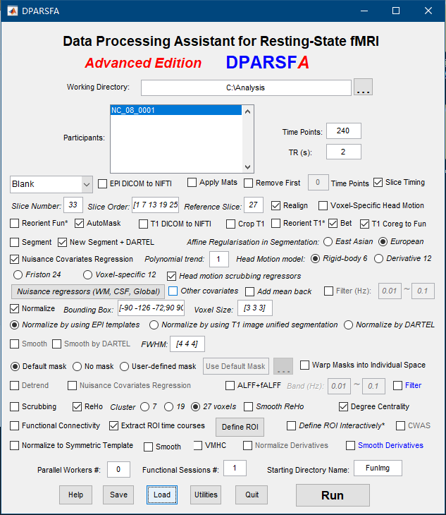
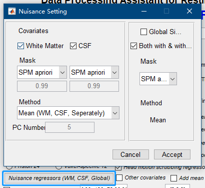
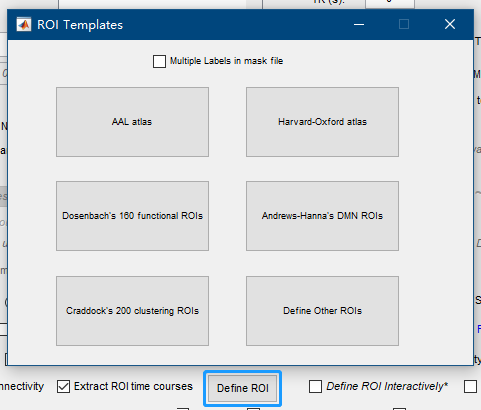
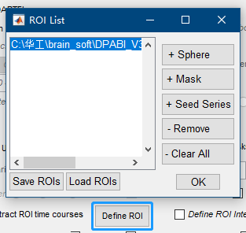
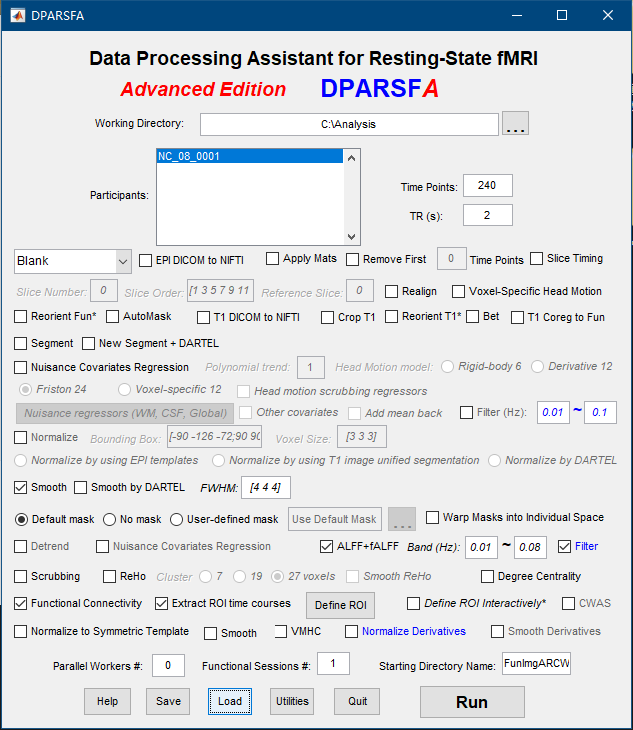
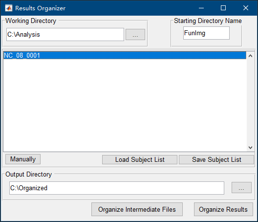
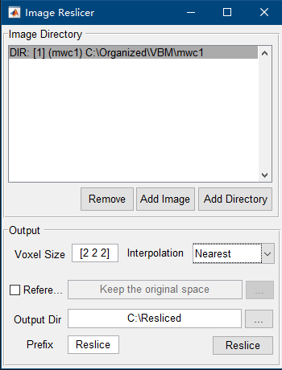

# NEURO-LEARN | LOCAL DATA PREPARATION

## HEADS UP

- This workflow depends on DPABI, which is developed by Prof. Chaogan Yan, thus we would appreciate it if you cited [his work](http://www.rfmri.org/dpabi). Additionally, should you encounter any problem when using DPABI, try [this site](http://rfmri.org/dpabi);
- A standard version of Matlab is also required for this workflow, we recommend you to install R2018a, since we tested it on this version;
- We are working hard on developing a fully automated local data preparation workflow, so please stay tuned for it!

## External Dependencies

- Matlab R2018a
- DPABI v3.0
- SPM 12

## Getting Started

- Set directory structure exactly as follows:
  ```
  workspace
  | -- Analysis
  |    | -- FunImg
  |    |    | -- Subject_1
  |    |    |    | -- Subject_1.nii
  |    |    |
  |    |    | -- Subject_2
  |    |    | -- ...
  |    |    | -- Subject_n
  |    |
  |    | -- T1Img
  |    |    | -- Subject_1
  |    |    | -- Subject_2
  |    |    | -- ...
  |    |    | -- Subject_n
  |
  | -- Organized
  | -- Resliced
  ```
- Launch Matlab and type ```dpabi``` in the command window, then the GUI of DPABI will pop up, click DPASFA v4.3;
- Load the configuration file ```./compute_ReHo_DC.mat``` and the panel will look like this:
  
- Note that the buttons labeled ```Nuisance regressors (WM, CSF, Global)``` and ```Define ROI``` should be clicked respectively with further configuration as follows:
  
  
  
- Click RUN and wait for the jobs' completion;
- Load the configuration file ```./compute_ALFF_FC.mat``` and the panel will look like this:
  
- Click RUN and wait for the jobs' completion;
- Organize the results:
  - Select the ```The R-fMRI Maps Project``` and a panel will pop up;
  - Select the output directory named ```Organized``` as follows:
    
- Reslice the result image to obtain designated resolution, in our case, 3mm\*3mm\*3mm:
  - Select the ```Utilities``` and then select ```Image Reslicer```;
  - Set the output directory as ```Resliced```, the panel should look like this:
    
- Run the data preparation script named ```data_prep.m``` in Matlab, and a dataset file will be generated and ready for uploading.
